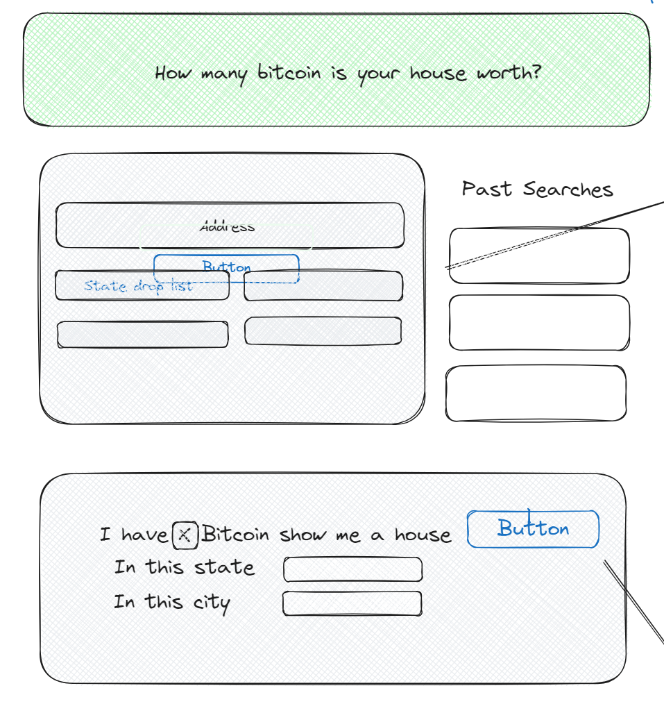

# Group-Project-1
Home to Bitcoin Conversion 

## Description 
This site enables users to lookup a given property's value in Bitcoin. The project calls two APIs to fetch a home's estimated price and Bitcoin's current exchange rate is USD. The site then returns a Bitcoin amount that a specified address is worth. 

Alternatively, the site enables users to search for homes less than a current Bitcoin value. For example, if a user would like to see houses they could purchase if they had 10 Bitcoin, they are able to specify that they have 10 Bitcoin, and the site will fetch results of houses that cost less than 10btc. 

## Mockup - Concept 

## Link 
https://sjones-njones.github.io/group-project-1

## Credits 
This site was produced by Group 6 with individual credits to 

@sjones-njones
@roqieux
@lcurtis0
@TonyDeleo98

## Usage 
Please see the license in the repo
